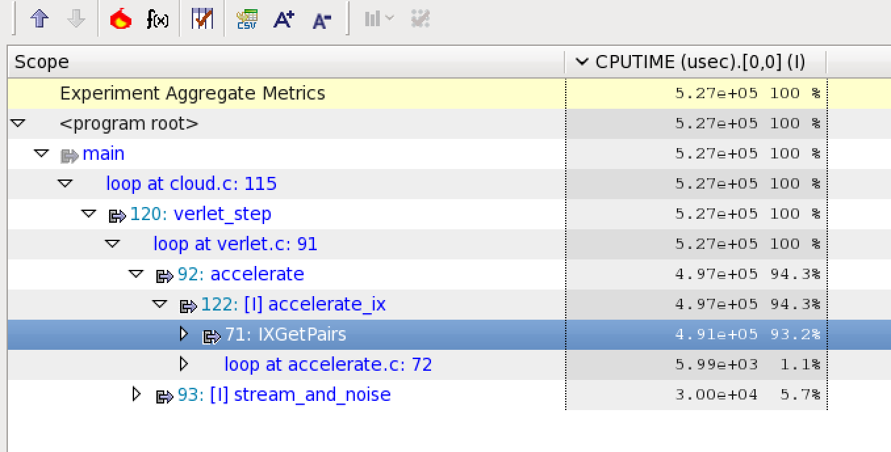
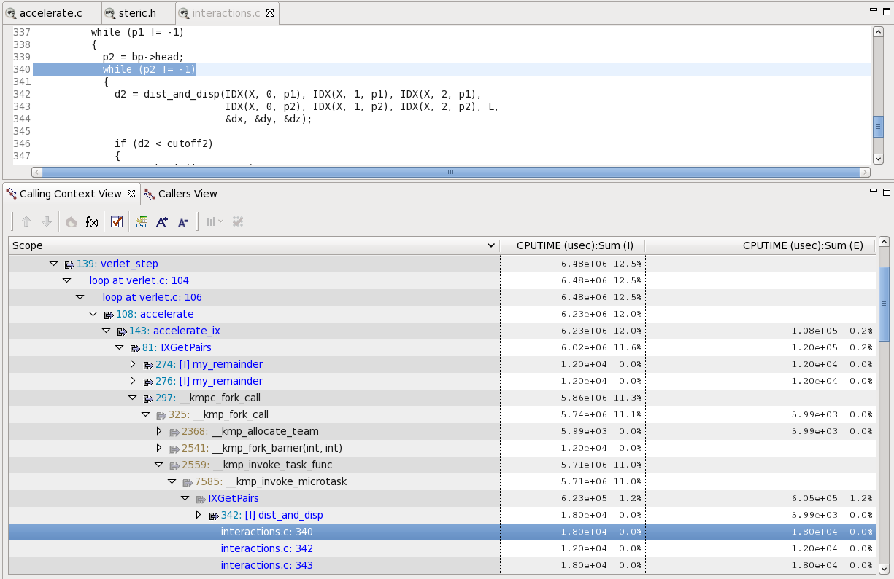
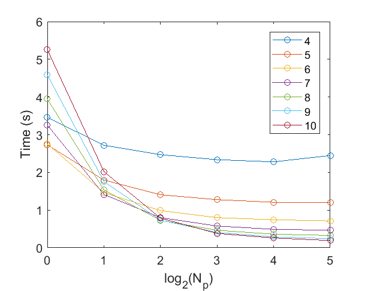

# Report

## Major changes

### Parallel get pairs



From the profile above, we see that GetPairs loop takes surprisingly large amount of time. To optimize, it must be parallelized. Calculation in each box is independent, which can be paralleled naturally.

In original program, all interaction pairs are recorded on one list. To parallel the process of finding and recording interaction pairs, the potential conflict of several threads writing on the list at the same time should be diminished.

- Firstly, an array of pair lists was built in IXCreate. The number of lists in the array equals to the number of threads.

- Secondly, the finding process are executed on multiple threads (IXGetPairs). Every time one thread find an interacting pair, it push the pair onto the list it owns (IXPushpair).

- Finally, all the lists in the array are joined into one list at the end of IXGetPairs, which will be passed to accelerate.



From the profile after optimization, we see that:

1. `omp_fork` is called, which means that omp parallel routine is successfully called. Meanwhile, the content of fork-join call is within the for loop we parallel, as expected.

2. Percentage of time cost of `GetPairs` significantly reduce, which means that this work is useful.

### SIMD Remainder

A new function of computing the remainder of a number with regard to the dimension of the cell is written as MY_REMAINDER in the file "steric.h". The function is set under "omp declare simd", which let the code vecotrized better.

Motivation and proof comes from hw4.

### Change the size of boxs

#### Motivation

Since we are reassigning particles to boxes in every iteration, it's better to have smaller boxes to reduce number of particles in each box.

Since the "radius" of particles is 1, minimum possible box length is 2, and maximum possible boxes along one axis is 10.



We see that as number of particles increase, the relative speed up becomes higher and higher.

### Parallel the function of computing the forces

#### Motivation

There are for loops that doesn't have data dependency inside. They should be parallelized. e.g. the force calculation:

```c
for (int p = 0; p < Npairs; p += 2)
  {
    int i = pairs[p].p[0];
    int j = pairs[p].p[1];
    double du[3];

    force(k, r, L, IDX(X, 0, i), IDX(X, 1, i), IDX(X, 2, i), IDX(X, 0, j), IDX(X, 1, j), IDX(X, 2, j), du);
    for (int d = 0; d < 3; d++)
    {
      IDX(U, d, i) += du[d];
      IDX(U, d, j) -= du[d];
    }
```

After finding the interacting pairs, the force between one pair is only related to the positions of the two particles, which is independent with other pairs. So the loop of computing forces should be paralleled with ease.

However, since there is the risk of adding forces exerted on one particle simultaneously, the code of adding forces onto the elements of the force array "U" are set atomic. Everytime only one thread can access to the position saving the force on a particle.

The force calculation is tuned into this:

```c
#pragma omp parallel for schedule(runtime)
  for (int p = 0; p < Npairs; p += 2)
  {
    int i = pairs[p].p[0];
    int j = pairs[p].p[1];
    double du[3];

    force(k, r, L, IDX(X, 0, i), IDX(X, 1, i), IDX(X, 2, i), IDX(X, 0, j), IDX(X, 1, j), IDX(X, 2, j), du);
    for (int d = 0; d < 3; d++)
    {
#pragma omp atomic
      IDX(U, d, i) += du[d];
#pragma omp atomic
      IDX(U, d, j) -= du[d];
    }
  }
```

### Not using AoS

Both the structure of saving the positions of particles AoS and SA in vector.c were tried. Using SoA is quicker than AoS. The reason of such difference may be that SoA is better for vectorization.

## Note

To stay on track with other course materials, I didn't have that much time to spend on this late submission (at least for now). Thus this version is simply a roll back of our previous version, correcting a fatal error we made, in order to make up for the grade of project 1.
And thus this branch is only forked from one previous feature branch and added some minor change.

I am planning to implement some more "fancy" optimizations, but that depends on time we have. If you don't see any more push to this branch, please kindly consider this as my final submission.
