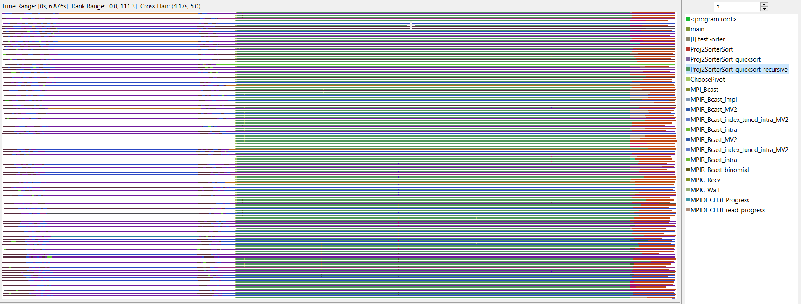
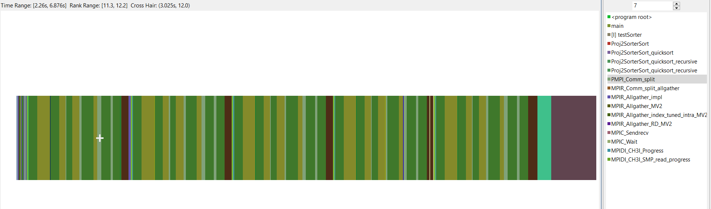
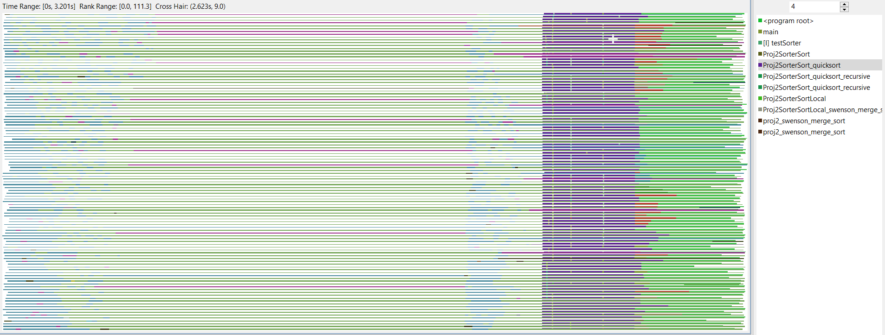
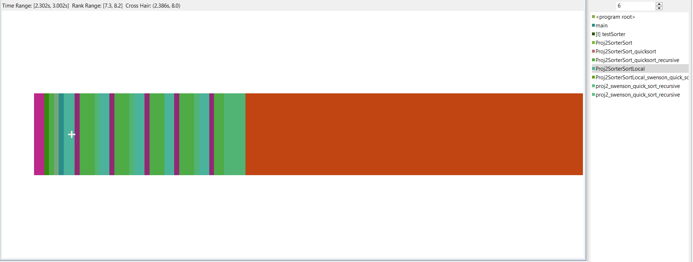
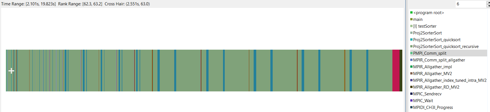
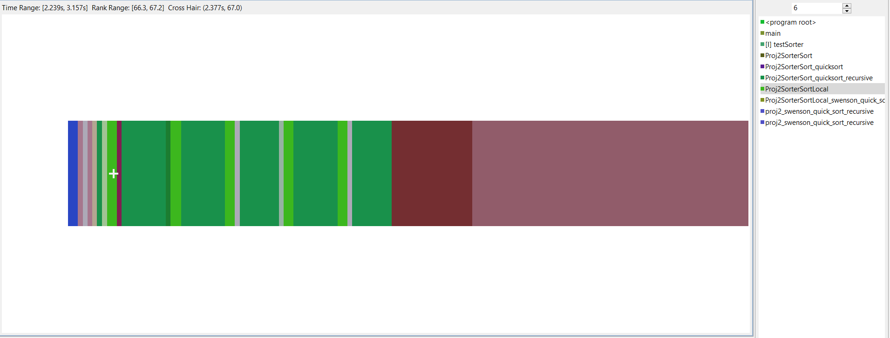
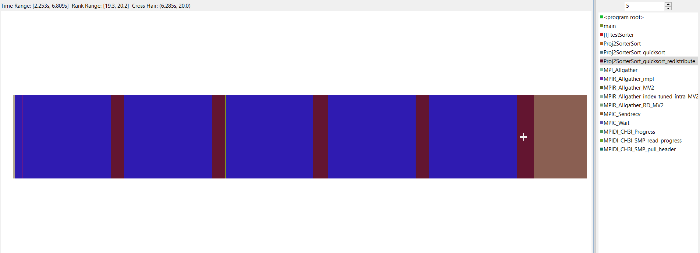
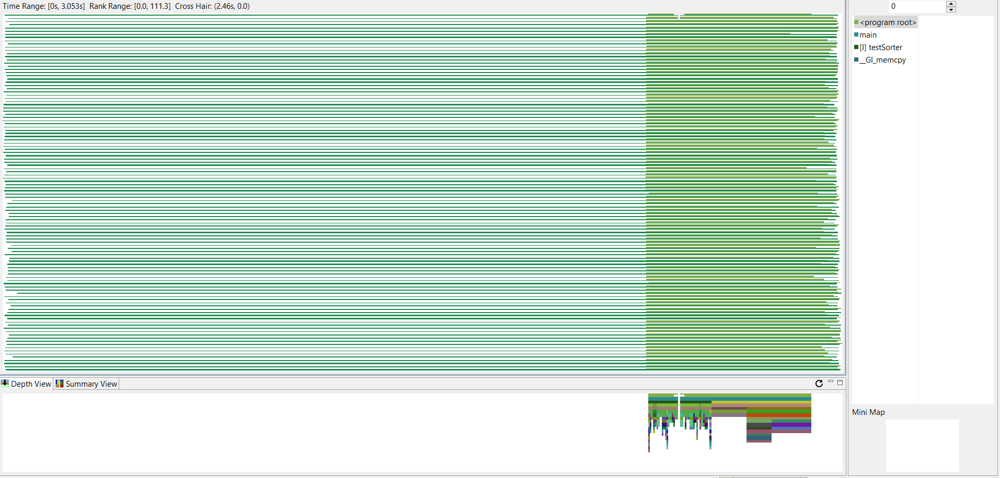

# Project2 Report


## Major Changes and Result

Firstly we run the original test program with hpcviewer to get a general idea about the code, and use this as baseline for optimizations.

The picture below is the composition of time used by all threads for running the initial codes. (Note that we didn't hide threads owned by MPI and this information is useful later)



The picture below is the composition of time used by One thread for running initial version of codes.



Note that there is 5 runs of sort program, each with different number of keys, and thus the trace show a peridocal pattern.

### Result

The picture below is the composition of time used by all threads (including the attached hpc threads) for running the modified codes using merge sort.



The figure below shows the composition of time used by One thread for running codes having all modifications.



From reading and analyzing source code of qsort and bitonic sort, we found several places that we can plugin some optimizations. Algorithmically, there is redundant qsortLocal redistribution called, and there is use cases of non-optimal MPI communication patterns.

### Split comm ahead (qosrt)

In every iteration there is a PMPI_Comm_Split process. Since the group of subcommunicators doesn't depend on input data, we can put it in the initialization of sorter object. Note that same subcomm is used in each of 5 runs, which saves lots of time.

The figure below shows the composition of time used by one thread for running codes putting all splitting together before sorting. Note that `PMPI_Comm_Split` disappear from the call stack.



### Use merge sort in each sort local (qsort)

In the qsort, each rank is receiving both lower (upper) half of sorted arrays from itself and its peer, and then a local quick sort is done on the received array. Not only is quick sort reaching its theoretical worst case, but also we are doing redundant sort if the input is two monotonic sub-arrays. In this case, a "merge" would be enough to give use a sorted result given such input. Note that merge is done right after receive of any array to avoid have more than 2 monotonic components.


It is obvious that merge sort reduces the time of computation substantially.

The figure below shows the composition of time used by One thread for running codes using merge sort.



### Remove redundant redistribution (qsort)

Although not visible in the trace viewer, the redistribution of the sorted array is executed in all iterations of quichsort function, which is redundant. We only need to do this redistribution at the last iteration to return correct result, since uneven number of keys doesn't break the sort.

The optimization here including extract the redistribute part into a new function.

The figure below shows the composition of time used by one thread for running codes redistributing the sorted arrays at the last iteration.



Since in the initial code this part is not independent, it is not easy to compare the improvement of the modification with the initial code by looking at the figures; however, the slightly increase of proportion of the finalize part in the whole running time still shows that the time of sorting decreases because of the modification.

### Change Ssend to Isend (bitonic sort)

Last but not least, the communication method between threads may also influence the total time of running the codes. In some places, using MPI_Isend is better for the reason that the thread sending messages may not be blocked by the thread receiving process. It is also modified in the code.

The new codes are obtained by adding all of the modifications mentioned above together. The picture below is the composition of time used by all threads (including the attached hpc threads) for running the codes having all modifications.



## Note

All tests are executed by the following command with nodes=4:ppn=28

```bash
mpirun  -f ${PBS_NODEFILE} -n ${PBS_NP} ./test_proj2 160 400000 32 0 5 1 1 0
```

Note that although we did optimize bitonic sort, since the code is tested and graded on n=112, and we did enough optimization on qsort, bitonic sort is not used at all.
Also, we are not optimizing when partially_sorted=1 sine its not the baseline case and we don't have extra time for that.